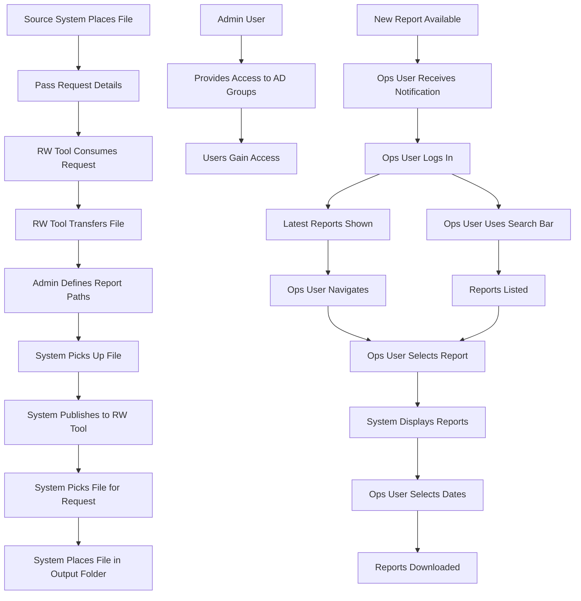

```mermaid
flowchart TD
    A[Source System Places File] --> B[Pass Request Details]
    B --> C[RW Tool Consumes Request]
    C --> D[RW Tool Transfers File]
    D --> E[Admin Defines Report Paths]
    E --> F[System Picks Up File]
    F --> G[System Publishes to RW Tool]
    G --> H[System Picks File for Request]
    H --> I[System Places File in Output Folder]

    J[Admin User] --> K[Provides Access to AD Groups]
    K --> L[Users Gain Access]

    M[New Report Available] --> N[Ops User Receives Notification]
    N --> O[Ops User Logs In]
    O --> P[Latest Reports Shown]
    O --> Q[Ops User Uses Search Bar]
    Q --> R[Reports Listed]
    P --> S[Ops User Navigates]
    S --> T[Ops User Selects Report]
    R --> T
    T --> U[System Displays Reports]
    U --> V[Ops User Selects Dates]
    V --> W[Reports Downloaded]
```

